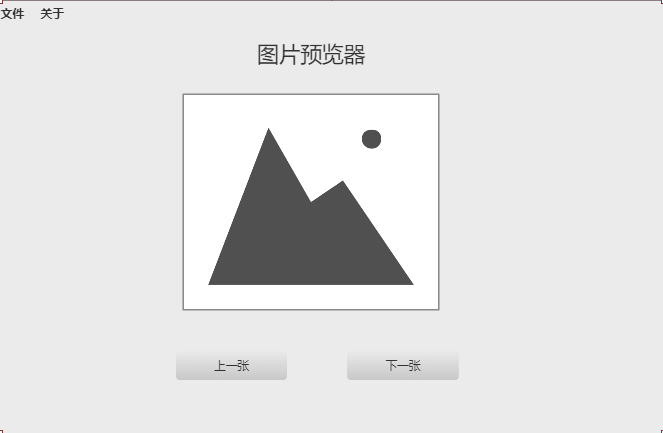
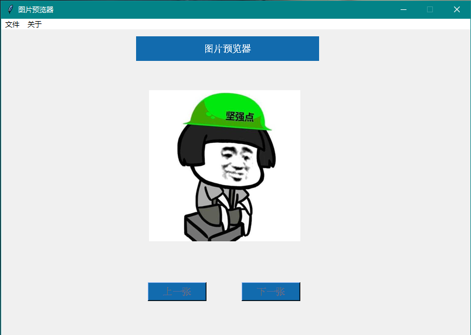
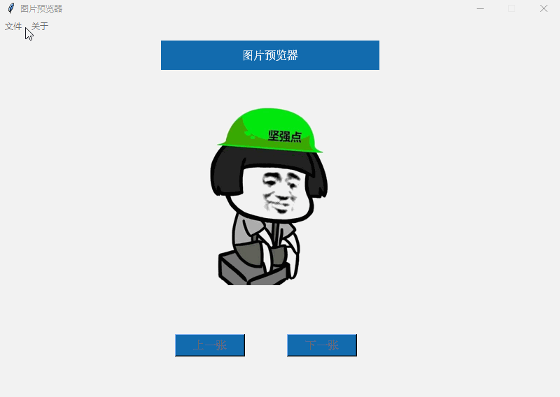

# Python—动手用tkinter编写一个图片预览器

​         学习python，培养兴趣是第一步。我们大多数人都是对看得见的东西才感兴趣，所以我们今天就用python自带的tkinter库编写一个图片预览器。

## 1. 设计个UI

首先简单设计一下UI，大概长下面这个亚子：



## 2. 咋实现呢

首先，使用tkinter快速搭建一个图形界面的框架，定义一个Picture类。

```python
from tkinter import *

class Picture(object):
    def __init__(self, init_window_name):
        self.window = init_window_name
    def init_window(self):
        self.window.geometry('800x520+500+100')  # 设置窗口的大小
        self.window.resizable(0, 0)  # 防止用户调整尺寸
    	self.window.title("图片预览器")
        self.window.mainloop()
if __name__ == "__main__":
    windows = Tk()
    picture = Picture(windows)
    picture.init_window()
```

这段代码相当于创建了一个空白的画板，下面就按照我们设计的UI在这个画板上画出相似的UI,首先顶部“图片预览器”字样，可以使用`tkinter`的`Label`函数。

```python
self.welcome = Label(self.window, text='图片预览器', fg='white', bg='#126bae', font=('Arial', 12), width=34,height=2).place(x=230, y=10)
```

`place`函数是定义改字样的位置，`x`为横轴方向，`y`为纵轴方向。

接着实现初始化的图片，欢迎图，后面选择文件夹时再替换该图片，实现如下：

```python
self.img_open = Image.open(self.welcome_path).resize((258, 258))
self.image = ImageTk.PhotoImage(self.img_open)
self.label_img = Label(self.window, image=self.image)
self.label_img.place(x=250, y=100)
```

注意：`tkinter`如果要加载`jpg`或者`png`格式的图片，需要借助`python`的另外一个常见的图像库`PIL`,我们在开头引入下面的包。

```python
from PIL import Image, ImageTk
```

接着，我们实现‘上一张’和‘下一张’按钮。

```python
self.pre_btn = Button(self.window, text='上一张', font=('Arial', 12), fg='white', width=10, height=1,command=self.pre_img, bg='#126bae', state=DISABLED)
self.pre_btn.place(x=250, y=430)
self.next_btn = Button(self.window, text='下一张', font=('Arial', 12), fg='white', width=10, height=1,command=self.next_img,bg='#126bae', state=DISABLED)
self.next_btn.place(x=410, y=430)
```

`state`有两种状态，`DISABLED`为禁用的状态，不可点击，`NORMAL`为可点击的状态，一开始因为我们没有选择文件夹所以让他不可点击。

按钮一般都有点击事件，`command`参数就是设置他的点击事件，具体的点击事件的实现，后面再介绍。

另外，我们再添加一个功能，就是当我们浏览图片的时候，图片下面再显示地址。

```python
self.var_path = StringVar()
self.path = Label(self.window,textvariable=self.var_path,
               highlightcolor='red', font=('Arial', 12), height=1).place(x=250,y=380)
```

程序刚开始的时候，我们没有选择图片，所以`path`是没有值的，`StringVar()`相当于一个占位符，后面可以通过,`StringVar().set()`方法，为它赋值。

最后不要忘记我们左上角还需要实现菜单的功能，这个也比较简单。

```python
self.menubar = Menu(self.window)
self.filemenu = Menu(self.window, tearoff=0)
self.aboutmenu = Menu(self.window, tearoff=0)
self.menubar.add_cascade(label='文件', menu=self.filemenu)
self.menubar.add_cascade(label='关于', menu=self.aboutmenu)
self.filemenu.add_command(label='打开', command=self.select_file)
self.aboutmenu.add_command(label='版本号: 1.0')
self.aboutmenu.add_command(label='作者: Humy')
self.window.config(menu=self.menubar)
```

需要注意的是，我们点击`打开`菜单，需要实现点击事件，我这里定义为了`select_file`，具体实现放在后面。

好了，到这里，程序的框架大概搭好了，接下来，要实现相关的点击事件了，实现：用户自定义打开一个文件夹，程序读取该文件夹所有以`jpg`和`png`结尾的图片文件，一开始将第一张显示在页面上，并且图片底下显示图片的绝对路径，然后通过点击上一张和下一张按钮，实现翻页，边界部分给与提醒。

我们先看看select_file函数：

```python
def select_file(self):
    chose_dir = tkinter.filedialog.askdirectory()  #打开目录
    path = glob.glob(os.path.join(chose_dir, '*.[jp][pn]g'))
    self.num = 0  # 当前显示图片索引
    self.img_num = len(path)  # 该目录下图片总数量
    self.image_path = path    # 目录下图片地址列表
    if self.img_num == 0:
        tkinter.messagebox.showinfo(title='提示', message='当前文件夹文件没有图片!')
    else:
        self.var_path.set(self.image_path[0].replace('\\', '/'))  # 前面提到的给图片地址占位符设置值
        img_open = Image.open(path[0]).resize((258, 258))
        image = ImageTk.PhotoImage(img_open)
        self.label_img.configure(image=image)
        self.label_img.image = image
        self.next_btn['state'] = NORMAL    # 当选择了文件夹，让下一页按钮状态变成可用
        self.pre_btn['state'] = NORMAL  
```

next_img()函数如下：

```python

def next_img(self):
    self.num += 1
    if self.num >= self.img_num:
        self.num = self.img_num - 1
        tkinter.messagebox.showinfo(title='提示', message='到头了哦！')
    img_open = Image.open(self.image_path[self.num]).resize((258, 258))
    self.var_path.set(self.image_path[self.num].replace('\\', '/'))
    image = ImageTk.PhotoImage(img_open)
    self.label_img.configure(image=image)
    self.label_img.image = image
```

pre_img()函数同理

```python
def pre_img(self):
	self.num -= 1
	if self.num < 0:
		self.num = 0
		tkinter.messagebox.showinfo(title='提示', message='啊偶！没有图片了')
	img_open = Image.open(self.image_path[self.num]).resize((258, 258))
	self.var_path.set(self.image_path[self.num].replace('\\', '/'))
	image = ImageTk.PhotoImage(img_open)
	self.label_img.configure(image=image)
	self.label_img.image = image
```

好了，到这里，一个简单的图片预览器就做好了，最终效果如下。



我们再看看运行的状态：




